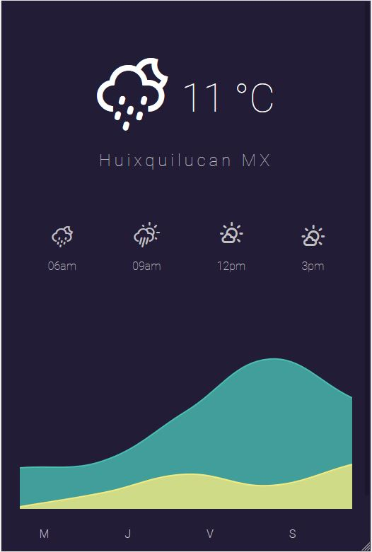
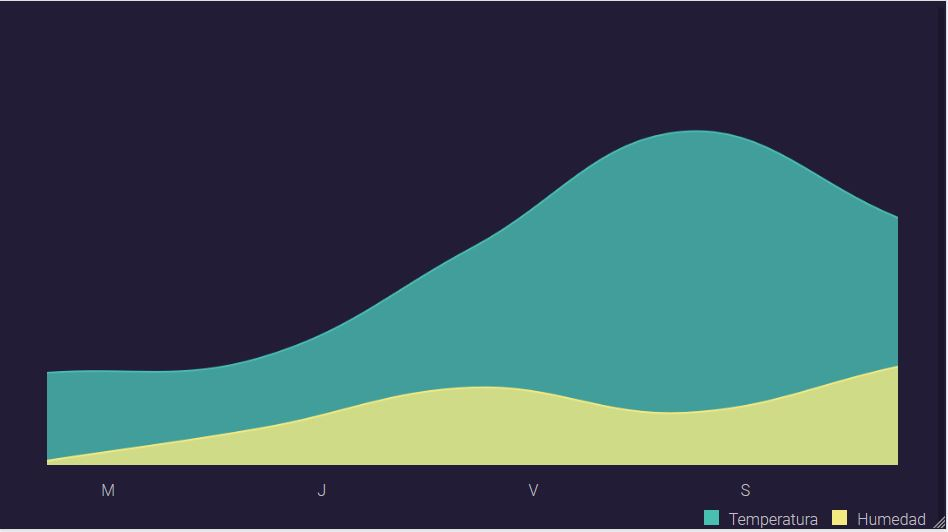
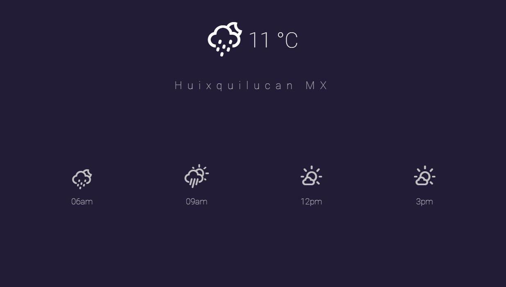

# Weather App

Como su nombre lo indica esta aplicación permite conocer el clima, no solo
al instante sino tener un pronóstico de los siguientes días así como conocer parámetros como temperatura y humedad.

En las siguientes imágenes se observa el funcionamiento de esta.

*Importante: Para poder usar la aplicación en dispositivos móviles es necesario activar la ubicación, en 
dispositivos de escritorio basta con permiter acceder a la ubicaión desde el navegador*
### Funcionamiento en Dispositivos móviles





Cabe mencionar que esta aplicación fue diseñada para dispositivos móviles sin embargo también  funciona para dispositivos de escritorio sin embargo en este caso no se muestra la gráfica de la temperatura y humedad.



## Aspectos Técnicos

Esta aplicación obtiene los datos de la API de
[OpenWheater](https://openweathermap.org)

Para graficar se utiliza la librería
[char.js](http://www.chartjs.org)

Los iconos se obtuvieron de la siguiente librería
[weather-icons](http://erikflowers.github.io/weather-icons)

Puedes descargar la aplicación clonando el repositorio

```git clone https://github.com/carloscastanedan/weatherApp.git```

Además necesitas instalar las librerías con el comando

``` npm install ```

## Licencia

Copyright (c) 2018, Carlos Castañeda. (MIT License)
